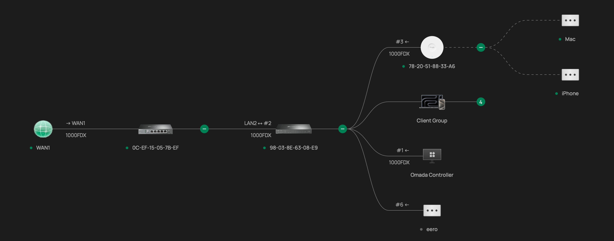
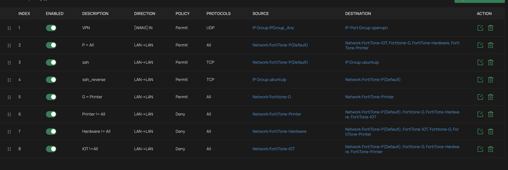

# Small Enterprise Network Lab

**Author:** Anthony Bollas
**Contact:** bollascareer@gmail.com | anthonybollas.com
**Stack:** FortiGate 60F (IDS/IPS) · TP-Link Omada (ER605 v2, SG2210P, EAP650, OC220) · VLANs · ACLs · OpenVPN/PKI

---

## Overview

This lab is a segmented small-enterprise network built on a layered security model: a dedicated FortiGate 60F firewall providing IDS/IPS inspection at the network edge, sitting in front of a TP-Link Omada software-defined network handling routing, VLAN segmentation, and access control. Rather than a flat network with all devices on one subnet, traffic is divided into five VLANs by function and trust level, with firewall ACL rules explicitly governing what's allowed to pass between them.

This mirrors the layered architecture used in small business and branch-office networks: a purpose-built security appliance inspecting traffic at the perimeter, paired with a centrally managed switching/routing layer for day-to-day segmentation and policy enforcement.

---

## Network Topology

**Traffic flow:** WAN → FortiGate 60F → TP-Link ER605 v2 (Omada gateway) → SG2210P (switch) → OC220 (Omada Hardware Controller) + EAP650 (access point) + client devices

## Hardware & Platform

| Component | Model | Role |
|---|---|---|
| Edge Security | FortiGate 60F | IDS/IPS — inspects traffic between the WAN and the internal network before it reaches the Omada gateway |
| Router / Gateway | TP-Link Omada ER605 v2 | VLAN routing and inter-VLAN ACL enforcement |
| Switch | TP-Link Omada SG2210P | PoE+ managed switching, VLAN tagging/trunking to the AP and wired devices |
| Access Point | TP-Link Omada EAP650 | Wi-Fi 6 AP, SSID-to-VLAN mapping for wireless clients |
| Controller | TP-Link Omada OC220 | Dedicated hardware controller providing centralized management of the switch, AP, and gateway from a single interface |
| Remote Access | OpenVPN (on the Omada gateway) | PKI-based certificate authentication for secure remote access |

Placing the FortiGate ahead of the Omada gateway means every packet entering the network from the WAN is inspected for known attack signatures and intrusion attempts before it ever reaches the routing/VLAN layer — a defense-in-depth approach rather than relying on the gateway alone.

---

## Network Segmentation (VLANs)

The network is divided into five VLANs, each isolating a category of devices by function and trust level:

| VLAN | Purpose |
|---|---|
| **Primary** | Trusted personal devices (laptops, phones), with broad access to the rest of the network |
| **IoT** | Smart home / IoT devices, isolated to prevent lateral movement from lower-trust hardware |
| **Guest** | Visitor network, isolated from internal VLANs except for explicitly permitted print access |
| **Server** | Hosts lab infrastructure, including the [Active Directory domain controller](./AD_Security_Lab_Documentation.md) |
| **Printer** | Dedicated segment for network printers |

## Access Control (ACLs)

Inter-VLAN traffic is governed by firewall ACL rules configured on the Omada ER605 v2 gateway, rather than allowing unrestricted routing between segments. Rules are evaluated in order, with more specific rules layered above broader deny rules:

| # | Rule | Effect |
|---|---|---|
| 1 | **VPN inbound** | Permits UDP traffic on WAN1 destined for the OpenVPN port group, allowing remote clients to establish a VPN connection |
| 2 | **Primary → All** | Primary VLAN devices are permitted full access to IoT, Guest, Server, and Printer VLANs |
| 3 | **SSH (Primary → host)** | Permits TCP/SSH from Primary to a specific management host (`ubuntuip`) |
| 4 | **SSH reverse (host → Primary)** | Permits the reverse path, allowing that host to reach back into Primary over SSH |
| 5 | **Guest → Printer** | Permits Guest VLAN devices to reach the Printer VLAN, so visitors can print without broader network access |
| 6 | **Printer deny-all** | Denies the Printer VLAN from initiating traffic to any other VLAN, limiting it to responding only |
| 7 | **Server deny-all** | Denies the Server VLAN from initiating traffic to any other VLAN — it can be reached (per rule 2) but cannot reach out |
| 8 | **IoT deny-all** | Denies the IoT VLAN from initiating traffic to any other VLAN, containing lower-trust devices |

The overall model is a **default-deny posture with explicit allow exceptions**: Primary has broad reach into the network, but Server, Printer, and IoT are all locked down to prevent them from initiating unsolicited connections elsewhere — the same least-privilege approach used to contain lateral movement in production networks.

## Remote Access (OpenVPN / PKI)

An OpenVPN server is deployed on the Omada gateway with a full PKI configuration (custom Certificate Authority, server and client certificates), providing secure remote access into the network from any location without exposing internal services directly to the internet. This is the same VPN infrastructure used to remotely access the [Active Directory Lab](./AD_Security_Lab_Documentation.md), tying the two projects into a single cohesive home infrastructure environment.

---

## Skills Demonstrated

- Layered network security design (dedicated IDS/IPS appliance + segmented internal network)
- VLAN design and segmentation by function/trust level
- Firewall ACL rule authoring, including default-deny with targeted allow exceptions
- Centralized network management via a hardware SDN controller (Omada OC220)
- Secure remote access design (PKI-based OpenVPN)
- Integration of network infrastructure with a domain-based server environment

## Next Steps

- Document specific FortiGate IDS/IPS signature sets and any alerts/tuning performed
- Add a dedicated management VLAN for the Omada controller and other admin interfaces
- Expand ACL documentation with port-level detail for the SSH management rules

---

*This lab is part of an ongoing series of home infrastructure projects, alongside the [Active Directory Lab](./AD_Security_Lab_Documentation.md) and a Pi-hole DNS server deployment. Full write-ups at [anthonybollas.com](https://anthonybollas.com).*
